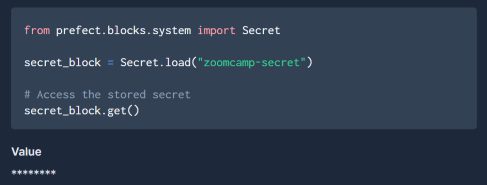

## Homework

Tasks: https://github.com/DataTalksClub/data-engineering-zoomcamp/blob/main/cohorts/2023/week_2_workflow_orchestration/homework.md

### Question 1. Load January 2020 data

```parquet-tools inspect data/green_tripdata_2020-01.parquet```

Answer: 447770

### Question 2. Scheduling with Cron

```prefect deployment build .\web_to_cloud.py:main_flow -n etl_deploy --cron "0 5 1 * *"```


### Question 3. Loading data to BigQuery

```
23:48:17.703 | INFO    | Flow run 'delicate-deer' - Executing 'ingest_data-e7246262-0' immediately...
23:49:12.290 | INFO    | Task run 'ingest_data-e7246262-0' - 7049370
```

```
23:49:28.255 | INFO    | Flow run 'delicate-deer' - Executing 'ingest_data-e7246262-1' immediately...
23:50:21.859 | INFO    | Task run 'ingest_data-e7246262-1' - 7866620
```

Answer: 7 049 370 + 7 866 620 = 14 915 990

### Question 4. Github Storage Block

```
prefect deployment build web_to_cloud.py:main_flow --name etl_deploy --tag dev -sb github/dev
prefect agent start -q 'default'
```

Answer: 88605

### Question 5. Email or Slack notifications

Flow run main-flow/amethyst-vole entered state `Completed` at 2023-02-03T21:35:36.027571+00:00.
Flow ID: 98b2d7e5-2cc0-49dc-ab4a-841a3e5f374b
Flow run ID: 17ae2293-0b1b-4499-af73-6a59282ee9dd
Flow run URL: https://app.prefect.cloud/account/3f514297-9eca-4496-bf22-17fe9cc6de30/workspace/da5f8dab-f1e7-4f4a-938d-4bd1c0c5d35d/flow-runs/flow-run/17ae2293-0b1b-4499-af73-6a59282ee9dd
State message: All states completed.

Answer: 567852

### Question 6. Secrets



Answer: 8