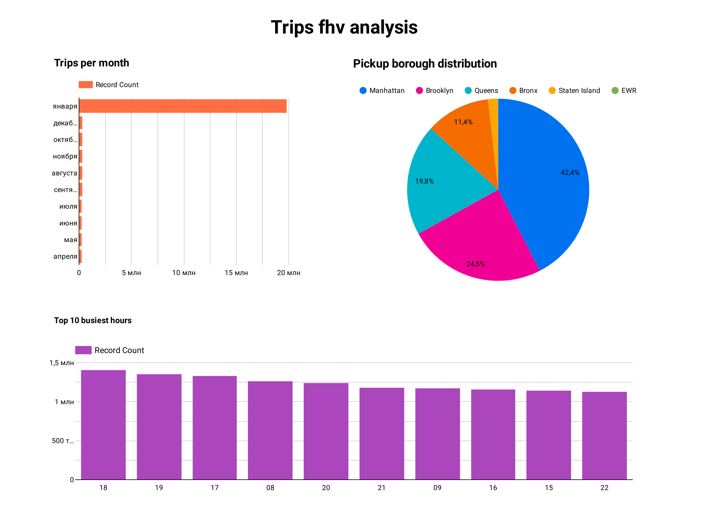

## Homework

Tasks: https://github.com/DataTalksClub/data-engineering-zoomcamp/blob/main/cohorts/2023/week_4_analytics_engineering/homework.md

### Question 1. What is the count of records in the model fact_trips after running all models with the test run variable disabled and filtering for 2019 and 2020 data only (pickup datetime)?

```dbt run -m +fact_trips --var 'is_test: false'```

Answer: 61648442

### Question 2. What is the distribution between service type filtering by years 2019 and 2020 data as done in the videos?

Answer: 89.9/10.1

### Question 3. What is the count of records in the model stg_fhv_tripdata after running all models with the test run variable disabled (:false)?

```dbt run -m stg_fhv_tripdata --var 'is_test: false'```

Answer: 43244696

### Question 4. What is the count of records in the model fact_fhv_trips after running all dependencies with the test run variable disabled (:false)?

```dbt run -m +fact_fhv_trips --var 'is_test: false'```

Answer: 22998722

### Question 5. What is the month with the biggest amount of rides after building a tile for the fact_fhv_trips table?



Answer: January